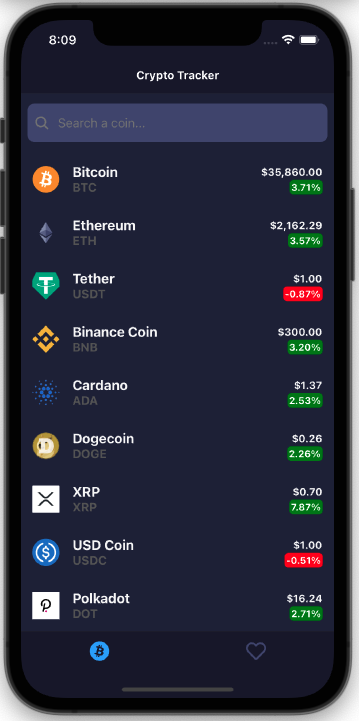
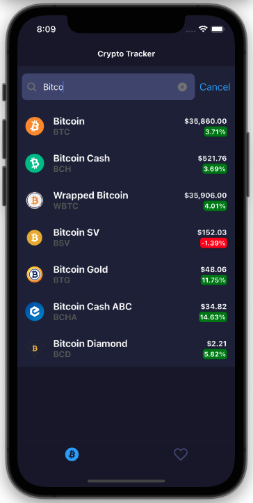
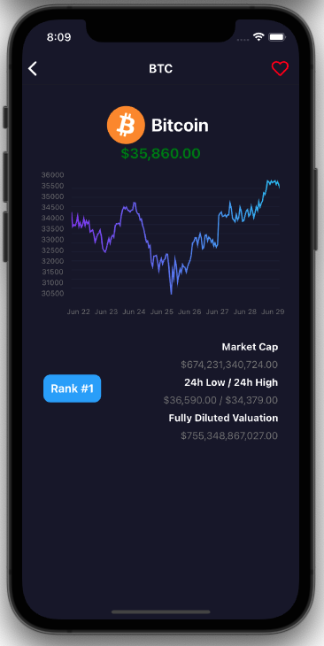
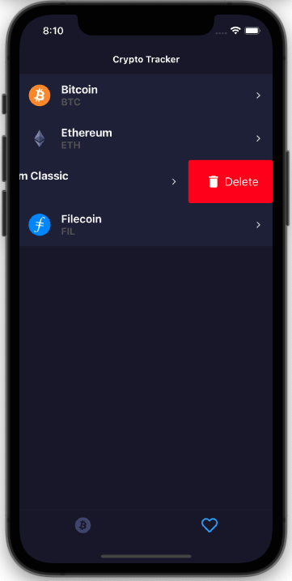
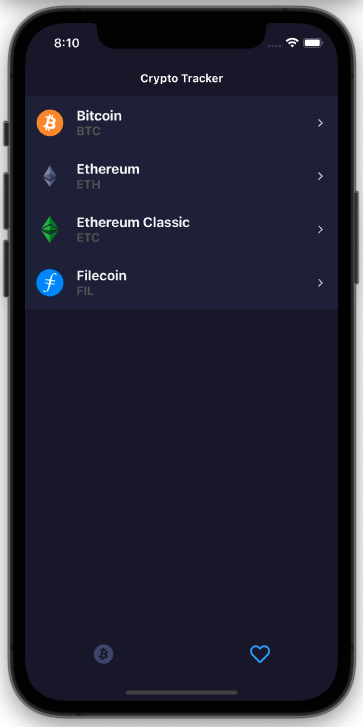
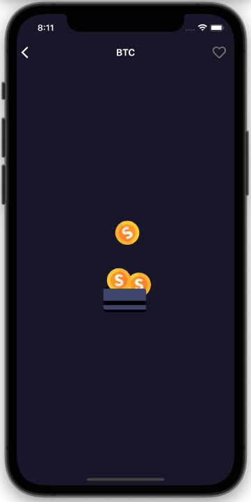

<div>
    
</div>

React Native App for (iOs and Android) managed by Expo that allow listing current crypto currencies in the market. This app consumes api from CoinGecko (https://www.coingecko.com/api/documentations/v3)

### `What is doing?`
- List current crypto currencies from CoinGecko
- Shows a Linear chart with variations of prices for last 7 days

### `What is using`
- Expo SDK SDK 41.
- React Navigation 5.
- Redux to handle the state.
- Redux-Thunk middleware to allow action creators use async logic.
- Lottie animations.

### `Install Dependencies`
```
npm install
```

### `Run project`
```
expo start
```

### `To Do`
- Splash Screen

### `Know Bugs`

### `Gallery`
<p float="left">
  
  
  
  
  
  
</p>